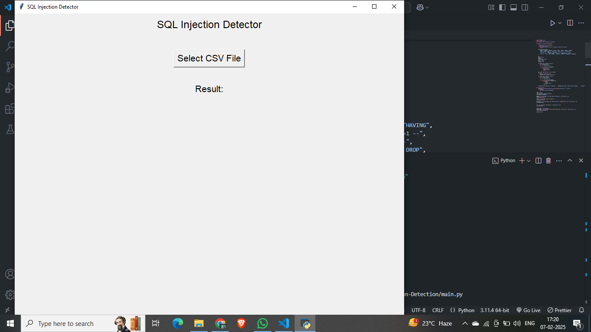
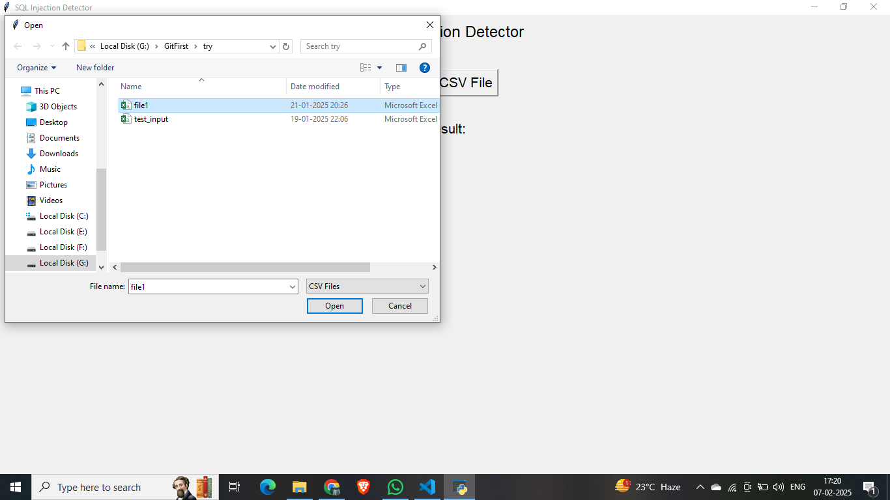
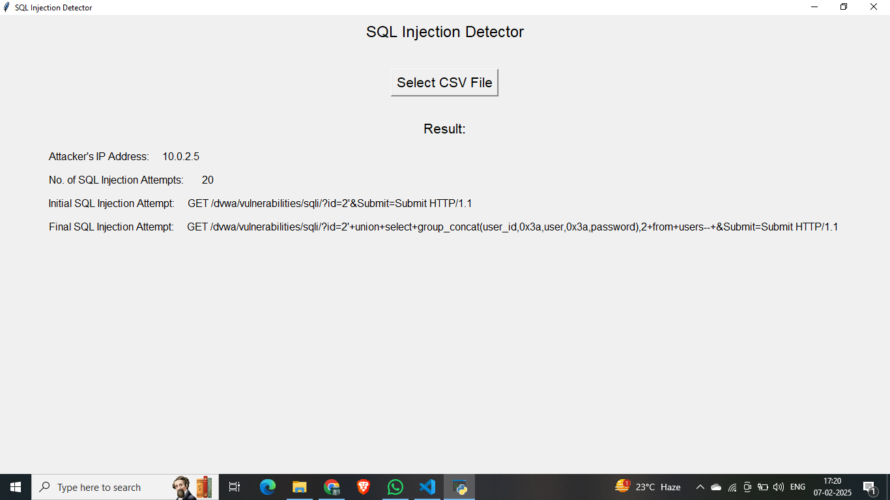

# 🔍 SQL Injection Attack Detector  

## 🚀 Overview  
This **SQL Injection Attack Detector** is a Python-based tool that analyzes network traffic logs (CSV files extracted from `.pcap` files) to detect **SQL injection attempts**. It helps cybersecurity professionals identify attackers and analyze malicious payloads effectively.  

## 📌 Features  
✅ **Attacker’s IP Identification** – Detects the source IP initiating SQL injection.  
✅ **SQL Injection Attempt Count** – Counts the total attempts made.  
✅ **First & Last Injection Payloads** – Extracts the initial and final attack payloads.  
✅ **User-Friendly GUI** – Simple interface for easy CSV file upload and analysis.  

## 🛠️ Technologies Used  
- **Python** 🐍  
- **Pandas** (for data analysis)  
- **Tkinter** (for GUI)  

## 📂 Input File Format  
The tool processes a **CSV file** with the following columns:  
| Column      | Description |
|-------------|------------|
| No.        | Packet number |
| Time       | Packet timestamp |
| Source     | Attacker's IP |
| Destination | Target IP |
| Protocol   | Protocol used (e.g., HTTP) |
| Length     | Packet length |
| Info       | Packet details |

## 📥 Installation & Usage  

### 1️⃣ Install Dependencies  
Ensure you have **Python 3.x** installed. Then, install dependencies:  
```bash
pip install pandas
```

### 2️⃣ Run the Application  
Run the program using:  
```bash
python sql_injection_detector.py
```

### 3️⃣ Select CSV File  
- Click **"Select CSV File"** in the GUI.  
- The tool will analyze the file and display results instantly.  

## 🖥️ Screenshot  
  
  
  

## 🏆 Output Format  
The program displays results in the following format:  
```txt
1A: Attacker's IP Address
2A: Total SQL Injection Attempts
3A: First SQL Injection Attempt Payload
4A: Last SQL Injection Attempt Payload
```

## 📌 Example Output  
```txt
1A: 192.168.1.100
2A: 5
3A: /search.php?q=' OR 1=1 --
4A: /login.php?user=admin' --
``` 